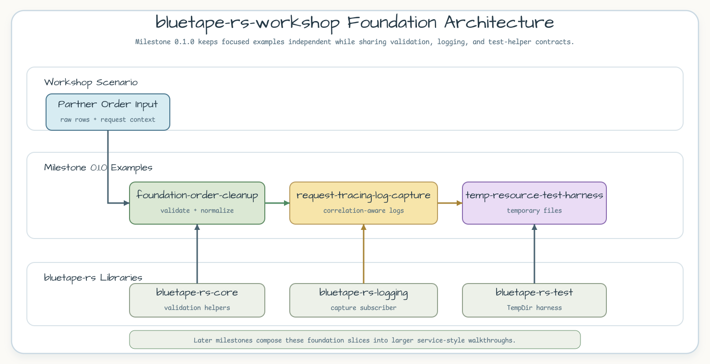
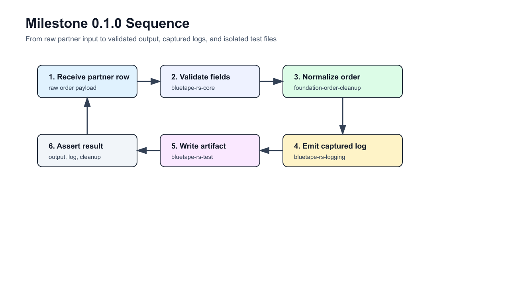

# bluetape-rs-workshop

- [English](README.md)
- [Korean](README.ko.md)

[`bluetape-rs`](https://github.com/bluetape4k/bluetape-rs)를 사용하는 실행
가능한 Rust 백엔드 예제 저장소입니다.

이 저장소는 `main` 하나만 장기 브랜치로 사용합니다. 기능 작업은 `main`을
대상으로 Pull Request를 엽니다.

## Milestone 0.1.0: Foundation Examples

0.1.0 마일스톤은 워크숍의 첫 기반 기능을 작은 실행 예제로 제공합니다. 각
예제는 독립적으로 읽을 수 있지만, 파트너 주문을 받아 요청 문맥을 보존하고
파일 시스템 부작용을 테스트에서 격리한다는 하나의 시나리오를 공유합니다.

| Example | Focus | Run |
|---|---|---|
| [`foundation-order-cleanup`](examples/foundation-order-cleanup/README.ko.md) | 파트너 주문 행 검증, 정규화, 타입 오류, 로그 캡처 | `cargo test -p foundation-order-cleanup` |
| [`request-tracing-log-capture`](examples/request-tracing-log-capture/README.ko.md) | correlation-aware 요청 로그 기록과 검증 | `cargo test -p request-tracing-log-capture` |
| [`temp-resource-test-harness`](examples/temp-resource-test-harness/README.ko.md) | 임시 작업공간 기반 파일 테스트 격리 | `cargo test -p temp-resource-test-harness` |

## Milestone 0.2.0: Collections and Async Examples

0.2.0 마일스톤은 `bluetape-rs-collections`와 `bluetape-rs-async` 예제를
추가합니다. 0.1.0의 검증/로깅 기반을 유지하면서 결정적 그룹화, bounded
fan-out, timeout, shutdown-aware worker 동작을 다룹니다.

| Example | Focus | Run |
|---|---|---|
| [`batched-order-windowing`](examples/batched-order-windowing/README.ko.md) | 파트너 주문 이벤트 그룹화, 결정적 배치 chunk, 페이지 반환 | `cargo test -p batched-order-windowing` |
| [`catalog-enrichment-fanout`](examples/catalog-enrichment-fanout/README.ko.md) | bounded provider fan-out, 필수 실패, 선택 warning, timeout 제어 | `cargo test -p catalog-enrichment-fanout` |
| [`shutdown-aware-worker`](examples/shutdown-aware-worker/README.ko.md) | timeout과 shutdown cancellation을 가진 worker loop | `cargo test -p shutdown-aware-worker` |

## Learning Path

1. `foundation-order-cleanup`에서 검증 헬퍼로 원천 파트너 입력을 타입이 있는
   도메인 출력으로 바꾸는 흐름을 봅니다.
2. `request-tracing-log-capture`에서 correlation ID가 구조화 로그로 전달되고
   테스트에서 검증되는 방식을 봅니다.
3. `temp-resource-test-harness`에서 파일을 만드는 테스트를 임시 작업공간과
   결정적 정리로 격리하는 방식을 봅니다.
4. `batched-order-windowing`에서 결정적 그룹화, chunking, paging을 적용합니다.
5. `catalog-enrichment-fanout`에서 required/optional 실패 계약을 가진 bounded
   async provider 작업을 봅니다.
6. `shutdown-aware-worker`에서 timeout과 shutdown cancellation 상태를 봅니다.

## Architecture



0.1.0에서는 각 기반 예제를 독립 crate로 유지합니다. 이후 마일스톤에서는 이
예제들을 더 통합적인 서비스 스타일 흐름으로 재사용합니다.

## Sequence



0.1.0 워크스루는 원천 파트너 입력을 `bluetape-rs-core`로 검증하고,
`bluetape-rs-logging`으로 요청 로그를 캡처하며, `bluetape-rs-test`로 테스트
아티팩트 파일을 안전하게 다룹니다.

## Repository Layout

```text
examples/
  foundation-order-cleanup/       # validation + normalization
  batched-order-windowing/        # deterministic grouping + chunking + paging
  catalog-enrichment-fanout/      # bounded async provider fan-out
  request-tracing-log-capture/    # correlation-aware log capture
  shutdown-aware-worker/          # timeout and shutdown-aware worker loop
  temp-resource-test-harness/     # temporary filesystem test harness
docs/images/readme-diagrams/      # README diagram sources and rendered PNGs
```

## Verify

```bash
make ci
```

`make ci`는 포맷, Clippy, 전체 워크스페이스 테스트를 all-features로 실행합니다.
