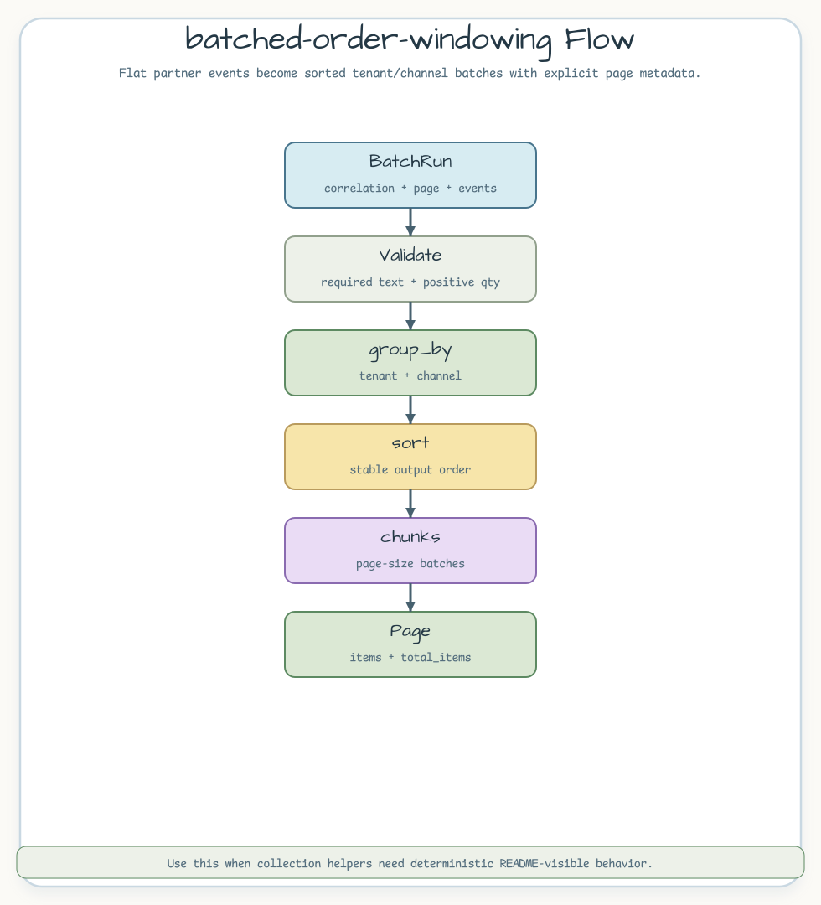

# batched-order-windowing

[English](README.md) | [한국어](README.ko.md)

파트너 주문 이벤트를 tenant/channel 기준으로 묶고, 각 그룹을 결정적인 배치로
자른 뒤 `Page`로 반환하는 예제입니다.

## 시나리오

파트너 이벤트는 납작한 행으로 도착합니다. 예제는 필수 필드를 먼저 검증하고,
로그용 correlation ID를 보존합니다. `HashMap` 기반 그룹 결과는 그대로 두면
순서가 흔들릴 수 있으므로, 페이지를 만들기 전에 한 번 정렬합니다.



## 대표 코드

```rust
let page = build_order_batches(BatchRun {
    correlation_id: "corr-batch-001".to_owned(),
    page_number: 0,
    page_size: 2,
    events: vec![
        OrderEvent::new("north", "web", "ord-1", "sku-1", 2),
        OrderEvent::new("north", "web", "ord-2", "sku-2", 1),
    ],
})?;

assert_eq!(page.total_items(), 1);
assert_eq!(page.items()[0].orders.len(), 2);
```

## 볼 점

- `require_not_blank`와 `require_positive`로 호출자 입력 오류를 타입으로
  반환합니다.
- `iter::group_by`는 `HashMap`을 사용하므로 페이지를 만들기 전에 그룹을
  정렬해야 합니다.
- `iter::chunks`와 `Page::with_meta`로 배치 크기와 페이지 메타데이터를
  명시합니다.

## 실행

```bash
cargo test -p batched-order-windowing
```
