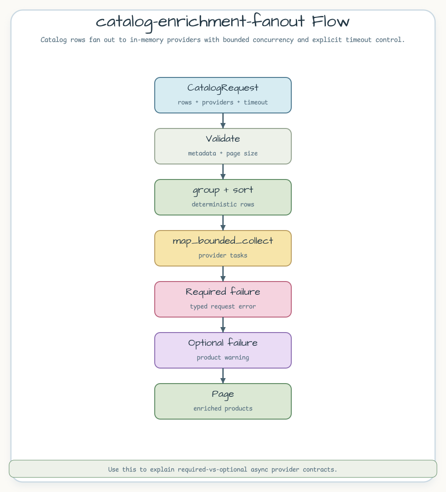

# catalog-enrichment-fanout

[English](README.md) | [한국어](README.ko.md)

catalog 행을 bounded async provider fan-out으로 보강하는 예제입니다. 필수
provider가 실패하면 요청을 실패로 돌리고, 선택 provider 실패는 product warning에
남깁니다.

## 시나리오

catalog 페이지는 재고와 추천 데이터를 함께 필요로 합니다. 예제는 요청
메타데이터를 검증하고, 행을 정렬 가능한 형태로 묶은 뒤,
`map_bounded_collect`로 provider 작업을 실행합니다. timeout/cancellation
경계를 감싸 두기 때문에, 느린 provider가 전체 테스트를 질질 끌고 가지 않습니다.



## 대표 코드

```rust
let page = enrich_catalog(request).await?;

assert_eq!(page.items()[0].category, "books");
assert!(page.items()[0].warnings.is_empty());
```

## 볼 점

- `map_bounded_collect`는 모든 provider 작업 결과를 입력 순서 기준으로
  기록합니다.
- `with_timeout_or_cancel`로 timeout과 cancellation 동작을 명시합니다.
- 필수 provider 실패는 `CatalogError::RequiredProvider`로 반환하고, 선택
  provider 실패는 product warning으로 노출합니다.

## 실행

```bash
cargo test -p catalog-enrichment-fanout
```
