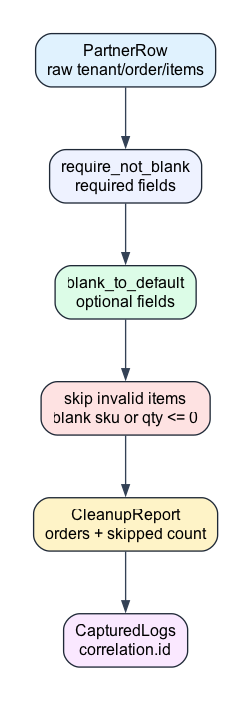

# foundation-order-cleanup

파트너 주문 원천 행을 내부 주문 모델로 정규화하는 예제입니다.
`bluetape-rs-core` 검증 헬퍼와 `bluetape-rs-logging` 로그 캡처를 함께
보여줍니다.

## Scenario

파트너 피드에는 비어 있는 선택 필드와 잘못된 라인 아이템이 섞일 수 있습니다.
이 예제는 호출자 입력 오류를 명확히 드러내고, 잘못된 라인 아이템은 건너뛰며,
correlation ID가 포함된 정리 로그를 캡처합니다.



## Representative Code

```rust
let report = normalize_partner_rows(
    "corr-001",
    &[PartnerRow {
        tenant: "north".to_owned(),
        order_id: "ord-100".to_owned(),
        customer: "alice".to_owned(),
        channel: " ".to_owned(),
        items: vec![PartnerItem {
            sku: "sku-1".to_owned(),
            quantity: 2,
            note: "fragile".to_owned(),
        }],
    }],
)?;

assert_eq!(report.orders[0].channel, "unknown");
assert_eq!(report.correlation_id.as_str(), "corr-001");
```

## What To Notice

- `require_not_blank("field", value)`로 필수 필드의 공백 입력을 거부합니다.
- `blank_to_default(value, "unknown")`로 선택 입력은 관대하게 기본값 처리합니다.
- `CapturedLogs`와 `capture_subscriber`로 정리 이벤트 로그를 테스트에서
  검증합니다.

## Run

```bash
cargo test -p foundation-order-cleanup
```
