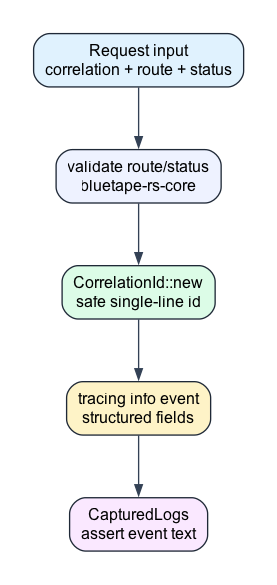

# request-tracing-log-capture

This example records a request summary with a `CorrelationId` and asserts the
captured log output in tests.

## Scenario

Request logs are useful only when the request boundary validates its route,
status, and correlation ID before emitting structured fields. The example uses a
captured subscriber so tests can assert the exact event payload.



## Representative Code

```rust
let captured = CapturedLogs::new();
let subscriber = capture_subscriber(captured.clone(), "info")?;

let summary = with_default(subscriber, || {
    record_request("corr-042", "/orders", 202)
})?;

assert_eq!(summary.status, 202);
assert!(captured.to_lossy_string().contains("corr-042"));
```

## What To Notice

- `CorrelationId::new` rejects blank, too long, or unsafe identifiers.
- `tracing::info!` writes structured fields such as `correlation.id` and
  `http.status`.
- `with_default` scopes the captured subscriber to the test body.

## Run

```bash
cargo test -p request-tracing-log-capture
```
