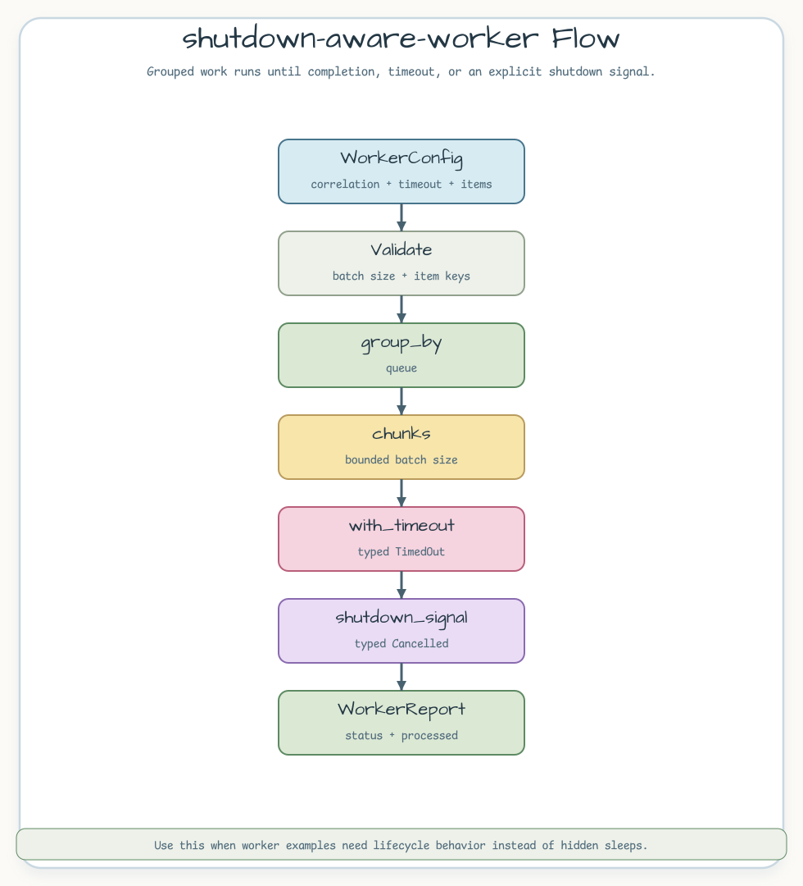

# shutdown-aware-worker

[English](README.md) | [한국어](README.ko.md)

작업이 정상 완료되거나, timeout이 발생하거나, shutdown signal이 요청될 때까지
그룹화된 worker item을 실행하는 예제입니다.

## 시나리오

worker는 비용이 다른 queue item을 받습니다. 예제는 실행 설정을 먼저 검증하고,
queue 기준으로 작업을 묶습니다. 각 queue는 batch 크기로 잘라 실행하고, 작업
단위 사이에서 shutdown signal을 확인합니다. 숨어 있는 sleep 테스트가 아니라,
완료/timeout/cancelled 상태를 호출자가 구분할 수 있게 만드는 쪽에 초점을 둡니다.



## 대표 코드

```rust
let (_trigger, signal) = shutdown_signal();
let report = run_worker(config, signal).await?;

assert_eq!(report.status, WorkerStatus::Completed);
```

## 볼 점

- `shutdown_signal`은 trigger/listener 소유권을 명시합니다.
- `with_timeout`은 deadline 만료를 `AsyncControlError::TimedOut`으로
  매핑합니다.
- shutdown은 `ShutdownSignal::wait`로 관찰하고
  `AsyncControlError::Cancelled`로 반환합니다.

## 실행

```bash
cargo test -p shutdown-aware-worker
```
