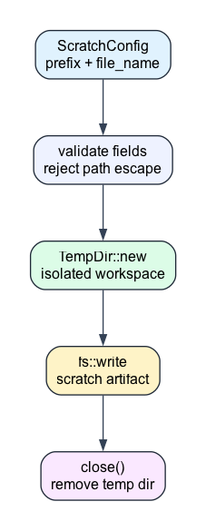

# temp-resource-test-harness

`bluetape-rs-test` 임시 디렉터리로 파일 시스템 부작용을 검증하고 테스트 간
상태 누수를 막는 예제입니다.

## Scenario

파일을 만드는 코드는 저장소의 공유 경로를 오염시키지 않고 테스트할 수 있어야
합니다. 이 예제는 scratch 파일명을 검증하고, 임시 작업공간에 행을 기록한 뒤,
작업공간을 닫아 cleanup을 증명합니다.



## Representative Code

```rust
let workspace = write_scratch_rows(
    ScratchConfig {
        prefix: "order-import".to_owned(),
        file_name: "orders.csv".to_owned(),
    },
    &["id,sku", "ord-1,sku-1"],
)?;

assert!(workspace.file_path().exists());
assert_eq!(workspace.row_count(), 2);
workspace.close()?;
```

## What To Notice

- `TempDir::new(prefix)`로 테스트 하나에 격리된 작업공간을 만듭니다.
- 절대 경로나 `..` traversal을 막기 위해 파일명을 검증합니다.
- `close()`로 임시 작업공간 제거를 결정적으로 검증합니다.

## Run

```bash
cargo test -p temp-resource-test-harness
```
